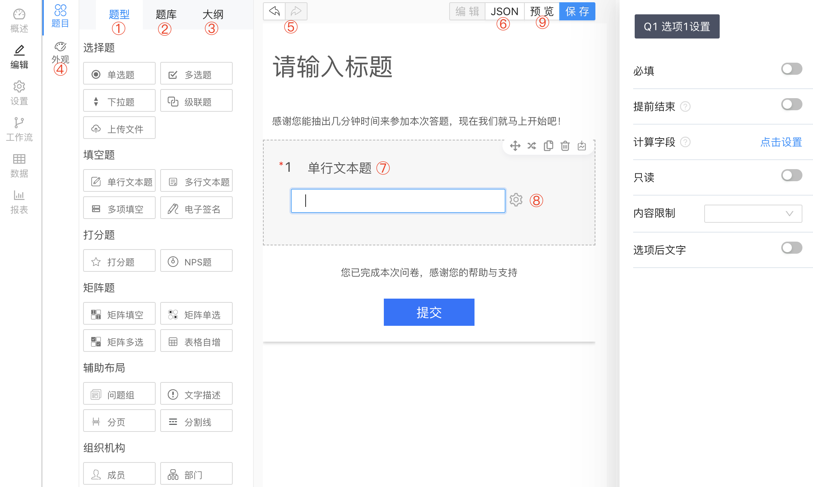

SurveyKing(卷王)是一个功能强大、安装简单的调查问卷系统，卷王的愿景是降低问卷系统门槛，让人人可以快速搭建一个调查问卷系统。

## 竞品对比

下面列出卷王和市面常用的一些调查问卷网站对比。

| 功能特性       | [卷王](https://surveyking.cn) | [问卷星](https://www.wjx.cn/) | [问卷网](https://www.wenjuan.com/) | [腾讯问卷](https://wj.qq.com) | [金数据](https://jinshuju.net/) | [表单大师](https://jsform.com) | [调问企业版](https://ent.surveyform.cn/) | [Tduck企业版](https://pro.tduckapp.com/) |
| -------------- | -------------------------- | -------------------------- | ------------------------------- | -------------------------- | ---------------------------- | ------------------- | ----------- | ------------------------------------- |
| 题型数量       | 一般                       | 多                         | 多                              | 少                         | 多                           | 多                  | 一般        | 一般                                  |
| 手机端创建问卷 | √                         | √                         | √                              | √                         | √                           | √                  | ×          | ×                                    |
| 私有部署价格   | 免费                       | 高                         | 高                              | 高                         | 高                           | 高                  | 一般        | 低                                    |
| 支持投票       | √                         | √                         | √                              | √                         | √                           | √                  | ×          | ×                                    |
| 支持考试       | ×                         | √                         | √                              | √                         | √                           | √                  | ×          | ×                                    |
| 问题校验       | 强                         | 强                         | 强                              | 一般                       | 一般                         | 一般                | 弱          | 弱                                    |
| 逻辑设置       | 强                         | 一般                       | 一般                            | 强                         | 一般                         | 一般                | 弱          | 弱                                    |
| 计算字段       | √                         | √                         | √                              | √                         | √                           | √                  | ×          | ×                                    |
| 文本替换       | √                         | √                         | √                              | √                         | √                           | √                  | ×          | ×                                    |

### SK 编辑器结构

1. 题型，可以点击或者拖拽将问题添加到编辑区域
2. 题库，
3. 大纲，显示当前问卷的大纲
4. 外观，可以设置问卷的背景图，页眉图
5. 撤销回退，编辑问卷时允许编辑、撤销
6. JSON，显示当前问卷的 JSON schema，编辑 JSON 会实时的同步到问卷，你可以自定义问题或者选项的 id
7. 问题，SK 的问题和选项的设置是分开的，点击问题侧边栏会弹出问题的设置
8. 选项，点击选项，侧边栏会弹出选项的设置
9. 预览，可以实时预览问卷，比如
