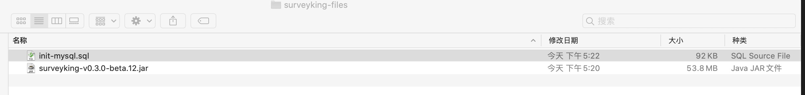
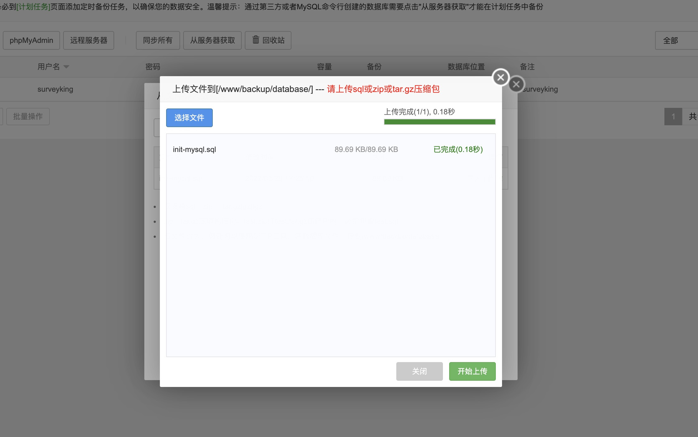
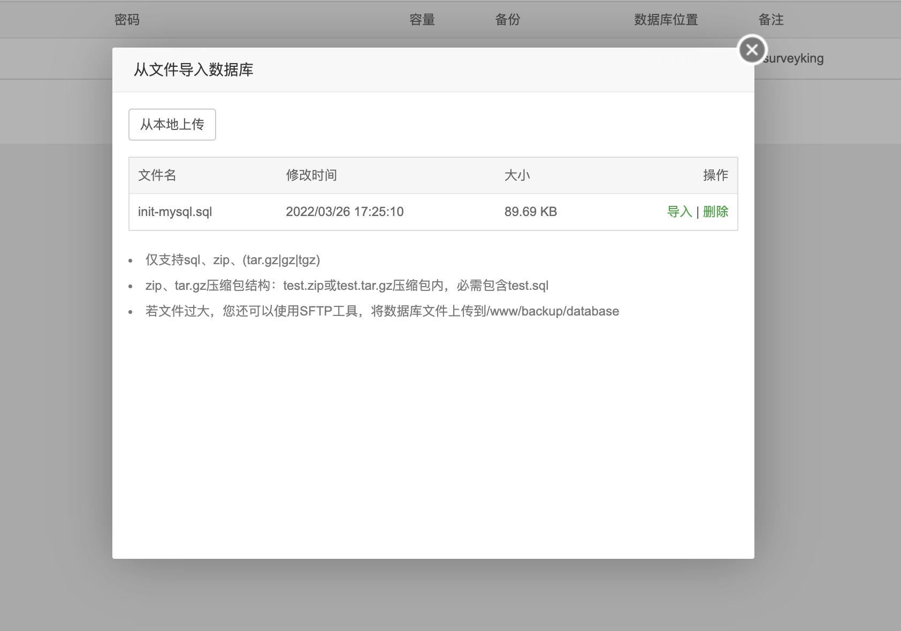
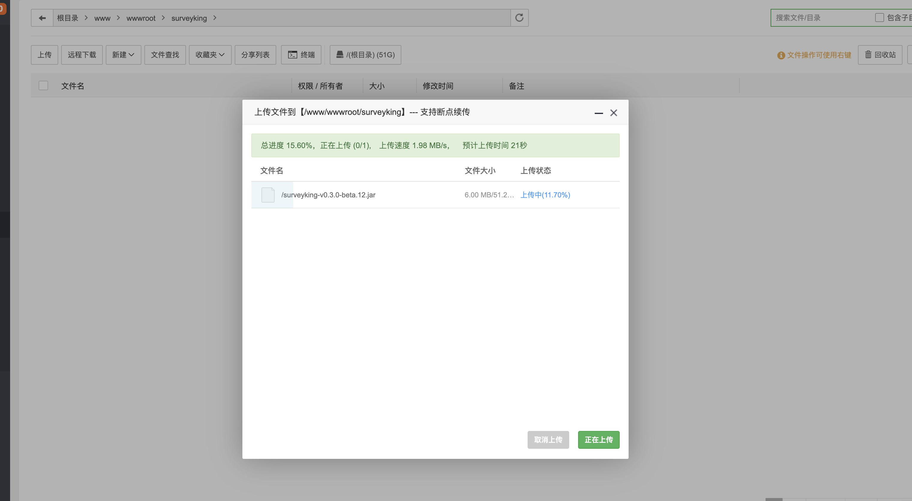
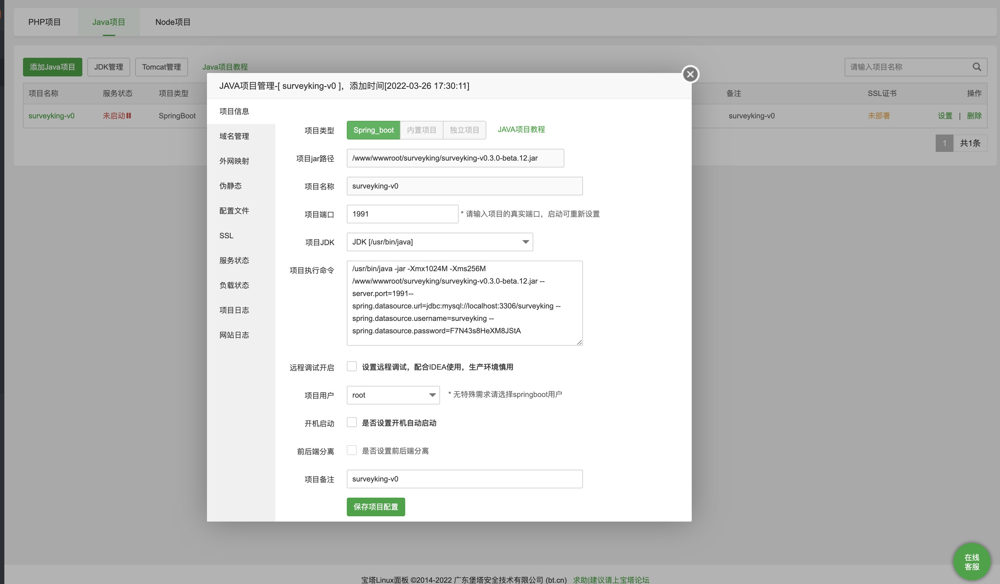
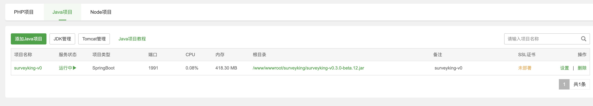

本文介绍如何使用宝塔来部署卷王。

## 环境要求

- mysql 版本 >= 5.6
- jdk 版本 >= 1.8

## 安装步骤

### 准备安装文件

本地准备好安装文件，可以通过 [gitee release 页面](https://gitee.com/surveyking/surveyking/releases) 获取最新的安装包(下载速度慢)，也可以加入 QQ 群(**338461197**)在群文件里面获取最新的安装包(下载速度快)。

1. 安装包 surveyking-v0.3.0.jar
2. 数据库文件 init-mysql.sql



### 创建数据库

通过宝塔面板创建数据库，记录用户名和密码。


选择数据库文件，并导入



开始导入



### 上传安装包

上传安装包到指定的目录，如 `/www/wwwroot/surveyking`



### 开始安装

开始创建 java 项目，选择项目 jar 路径，在项目执行命令里面输入如下命令，注意项目用户选择 root，点击确定。

```bash
/usr/bin/java -jar --Xmx1024M --Xms256M --server.port=1991 --spring.datasource.url=jdbc:mysql://localhost:3306/surveyking --spring.datasource.username=surveyking --spring.datasource.password=123456
```

参数说明：

- `--Xmx1024M` (可选) 设置运行最大使用内存
- `--Xms256M` (可选)  设置运行最小使用内存
- `--server.port=1991` (可选) 默认端口是 1991，你可以任意指定
- `--spring.datasource.url=jdbc:mysql://localhost:3306/surveyking` (必须) 数据库名，选择第二步创建数据库时设置的数据库名、用户名、密码
- `--spring.datasource.username=root` (必须) 数据库用户名
- `--spring.datasource.password=123456` (必须) 数据库密码



启动成功



## 获取帮助

安装过程或者使用过程中有任何问题，可以加群 **338461197** 寻求帮助。
