本文介绍小白如何部署卷王。

## 前期准备

### 在线视频教程

```
https://www.bilibili.com/video/BV15R4y1A7a2
```

**如果以下图片看不清，请用鼠标右键点击图片，然后选择在新窗口打开**

### 宝塔安装地址
```
https://www.bt.cn/new/download.html
```

## 软件安装

### 宝塔安装

1. 首先在宝塔官网下载btWindows面板

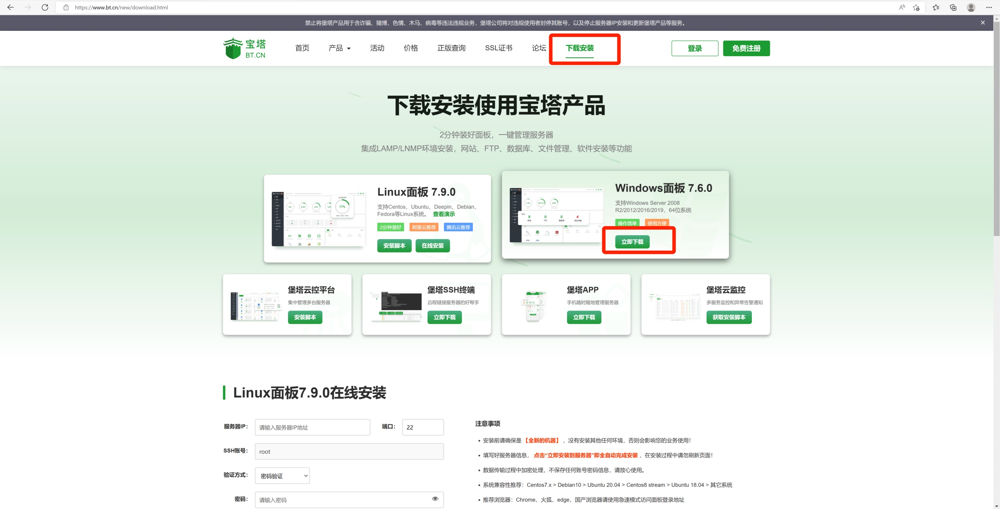

2. 下载完成后，打开宝塔安装文件，进行一键安装

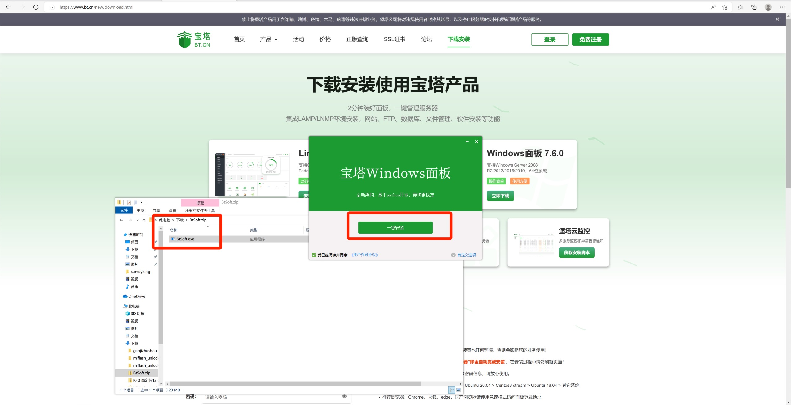

**4. 宝塔安装完成时可以看到以下的登录信息，这里需要用记事本记录，非常重要，丢失后重置比较麻烦**

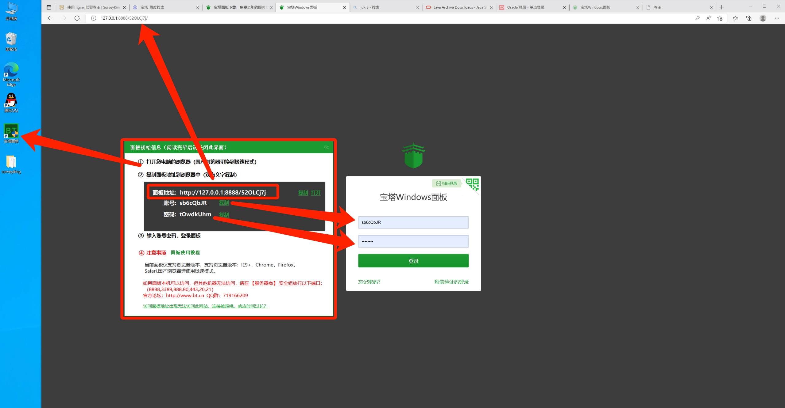

### 宝塔内部安装软件

1. 安装mysql、nginx
2. 进入 软件商店 在上方搜索mysql、nginx分别进行安装

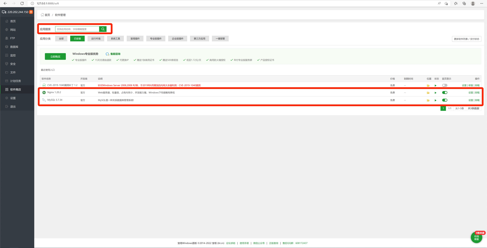

### 上传卷王项目

1. 选择 文件 菜单，点击新建，新建一个名为 surveyking 的目录

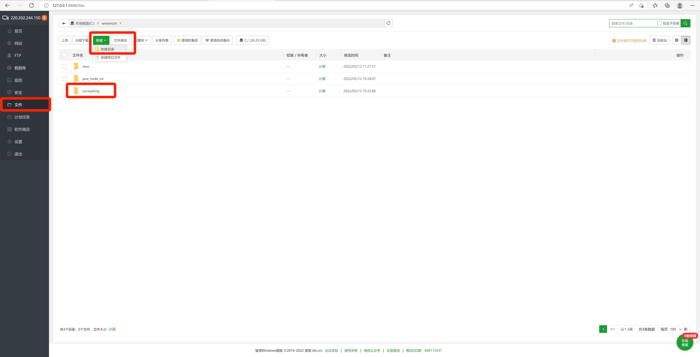

2. 在QQ群将卷王最新的jar包上传到 surveyking 目录下

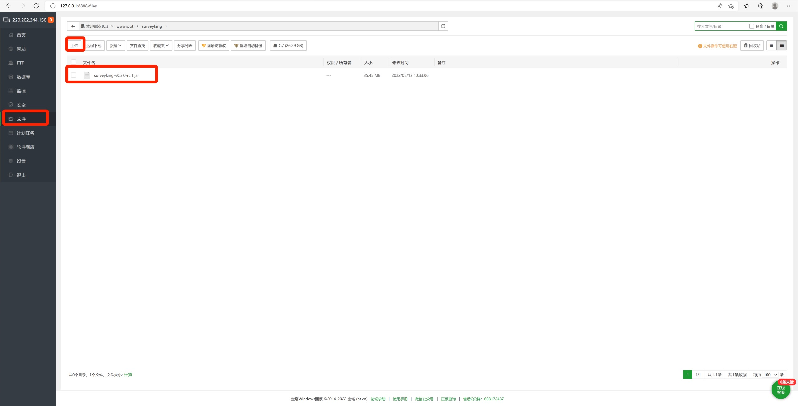

### 创建数据库

1. 选择 数据库 菜单，点击 添加数据库 按钮，输入数据库相关信息

```
数据库名：surveyking
字符集：utf8mb4
用户名：surveyking
密码：surveyking123123
访问权限：所有人
```

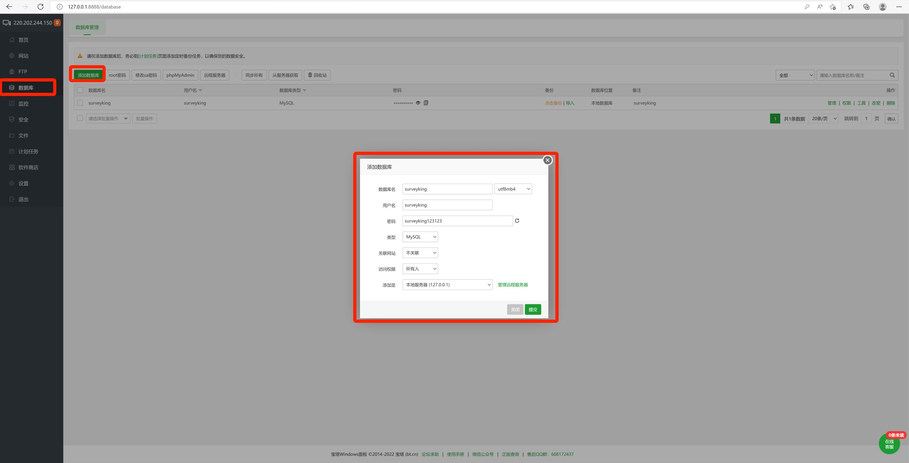

2. 上一步创建好以后，点击 导入，从QQ群下载最新的数据库脚本，导入到数据库

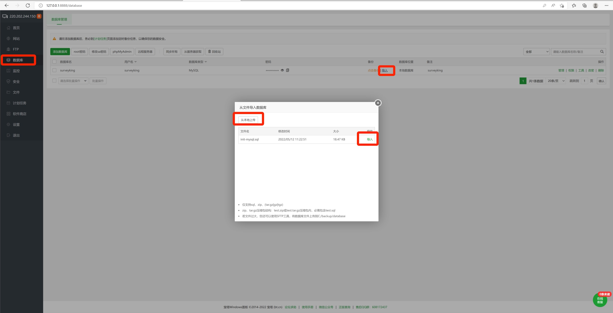

### 安装jdk

1. 在群共享里面下载Windows版本的jdk，并进行安装，切记安装目录不能有空格，否则会出现意外情况

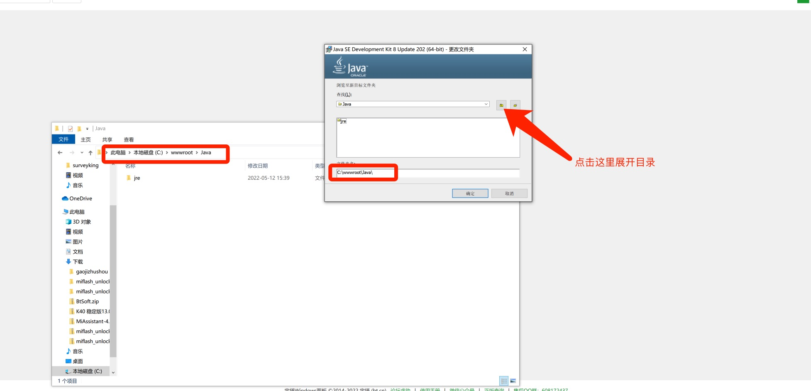

2. 谈着这个框的时候就可以把安装目录全部关闭了，证明jdk已经安装完成，后续的jre不需要安装

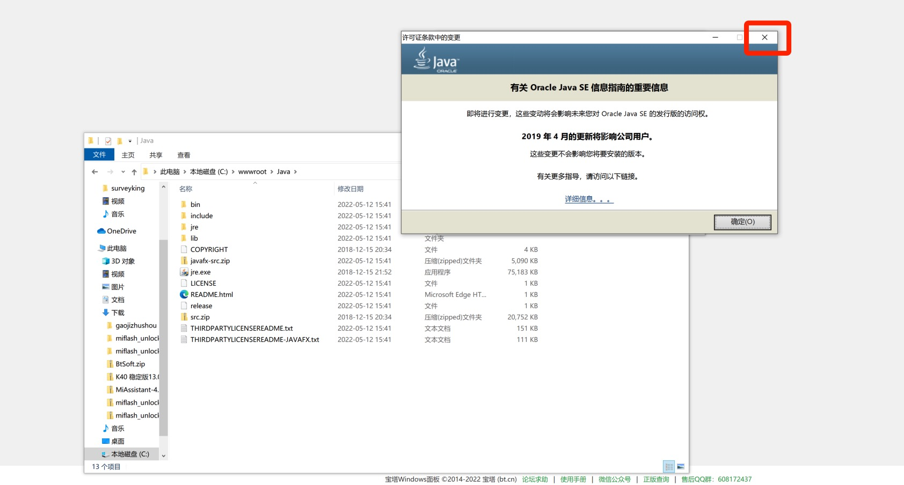

### 创建网站

1. 选择 网站 菜单，点击 Java项目 ，点击jdk管理，根据下图中的方式找到安装好的java.exe文件

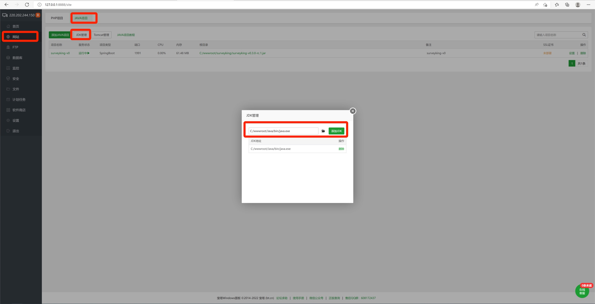

3. 选择 网站 菜单，点击 添加Java项目 按钮，输入相关信息

```
项目jar路径：C:/wwwroot/Java/bin/java.exe -ja
项目名称：surveyking-v0
项目端口：1991
项目执行命令：C:/wwwroot/Java/bin/java.exe -jar -Xmx1024M -Xms256M  C:/wwwroot/surveyking/surveyking-v0.3.0-rc.1.jar --server.port=1991 --spring.datasource.url=jdbc:mysql://localhost:3306/surveyking --spring.datasource.username=surveyking --spring.datasource.password=surveyking123123
```

参数说明：

- `-Xmx1024M` (可选) 设置运行最大使用内存，*注意这两个参数前面只有一个* **-**
- `-Xms256M` (可选)  设置运行最小使用内存
- `--server.port=1991` (可选) 默认端口是 1991，你可以任意指定，*注意这两个参数前面有一个* **--**
- `--spring.datasource.url=jdbc:mysql://localhost:3306/surveyking` (必须) 数据库名，选择第二步创建数据库时设置的数据库名、用户名、密码
- `--spring.datasource.username=surveyking` (必须) 数据库用户名
- `--spring.datasource.password=surveyking123123` (必须) 数据库密码

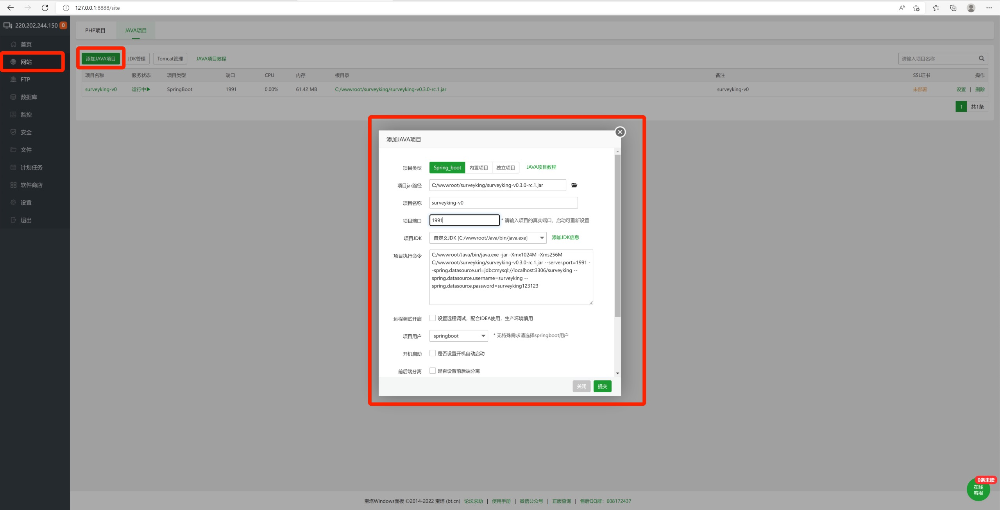

### 配置nginx

1. 进入到首页，点击nginx，选择 配置修改，将以下参数放到里面

```
server {
    listen      80;
    server_name  127.0.0.1;

    location / {
      proxy_pass http://localhost:1991;
      set_real_ip_from 0.0.0.0/0;
      real_ip_header  X-Forwarded-For;
      real_ip_recursive on;
      proxy_set_header Host      $host;
      proxy_set_header X-Real-IP $remote_addr;
      proxy_set_header X-Forwarded-For $proxy_add_x_forwarded_for;
      client_max_body_size 20m;
      proxy_http_version 1.1;
      proxy_set_header Connection close;
      proxy_set_header Upgrade $http_upgrade;
      proxy_set_header Connection "Upgrade";
      proxy_send_timeout 1800;
      proxy_read_timeout 1800;
      proxy_connect_timeout 1800;

    }
}
```

重要参数说明：

- `listen` 代理监听端口
- `server_name` 这里填写你的公网ip或者域名
- `proxy_pass` 填写你在创建网站的http:ip+端口,默认就填写http://localhost:1991

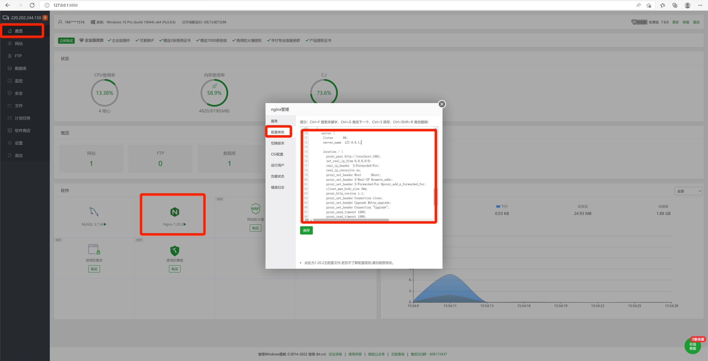

### 卷王项目页

1. 一切准备好以后在浏览器输入nginx的server_name就能出现如下图

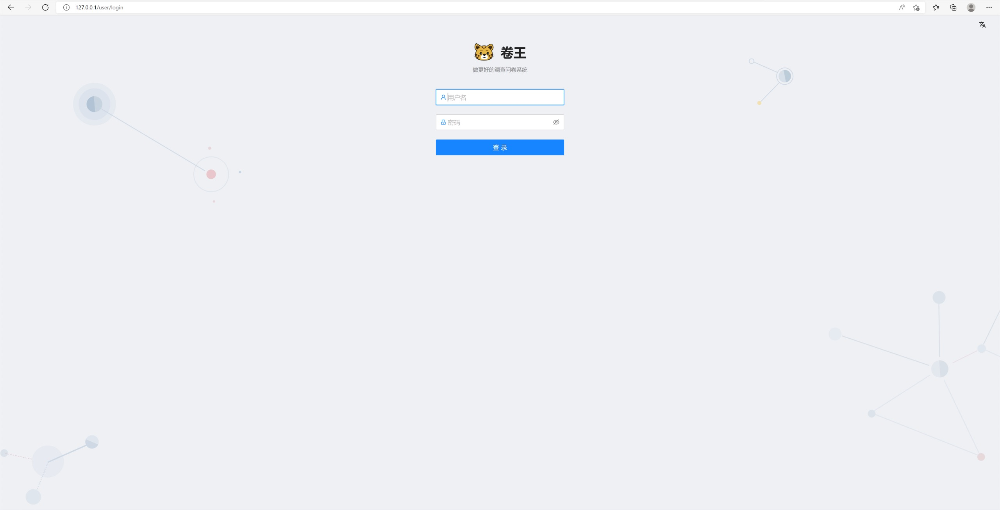
