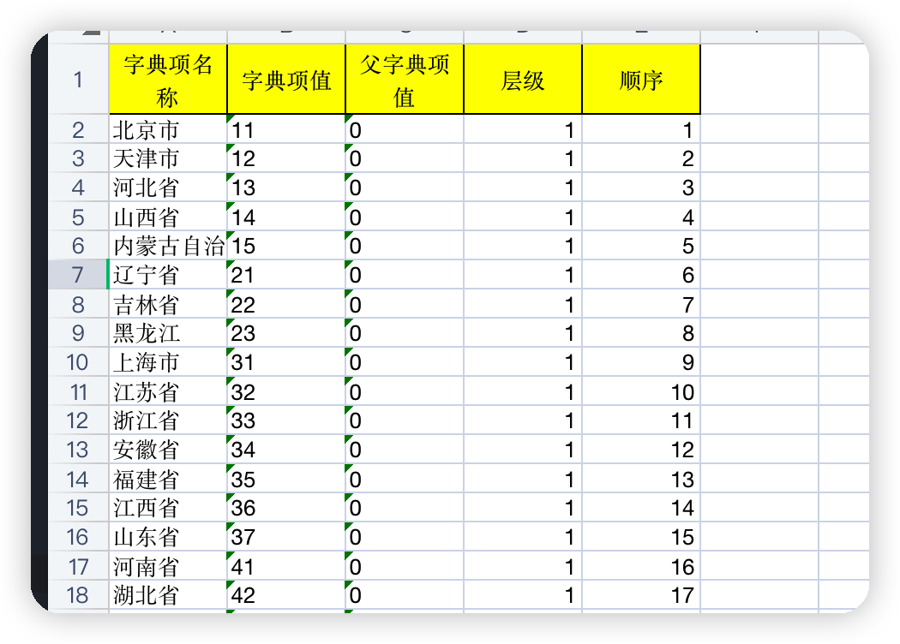
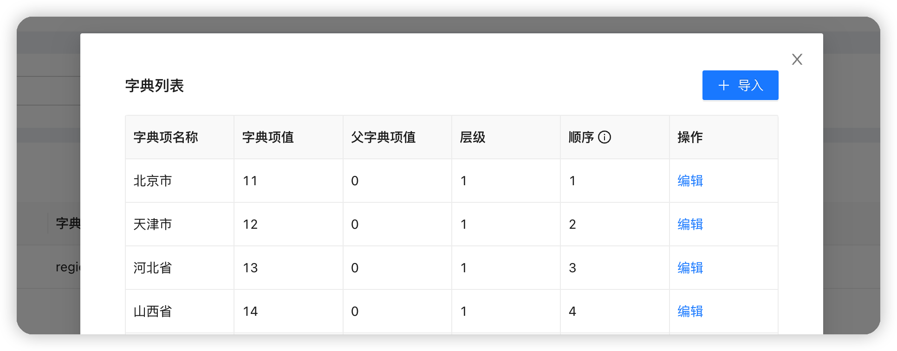
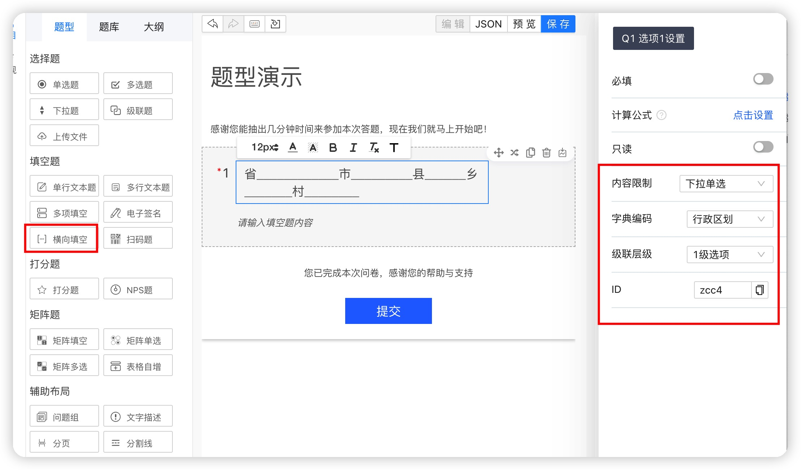

本文介绍如何使用卷王问卷考试系统创建省、市、县、乡、村五级行政区划级联题。

## 获取数据源

首先我们需要准备行政区划字典，数据可以通过下面的公开渠道获取，也可以在卷王的 Q 群里面来获取。

*   民政部、国家统计局：
    * [中华人民共和国民政部-中华人民共和国行政区划代码](http://www.mca.gov.cn/article/sj/xzqh/)
    * [中华人民共和国国家统计局-统计用区划和城乡划分代码](http://www.stats.gov.cn/tjsj/tjbz/tjyqhdmhcxhfdm/)
    * [中华人民共和国国家统计局-统计用区划代码和城乡划分代码编制规则](http://www.stats.gov.cn/tjsj/tjbz/200911/t20091125_8667.html)

添加到 Excel，格式如下

## 导入数据字典

在 `系统管理` -> `字典管理` -> `新建`，添加字典

然后点击字典项，并且选择导入我们的 Excel 模板数据，导入成功之后会在字典项列表里面显示所有的导入数据

## 编辑问卷添加

添加一道横向填空题，然后输入五个连续的填空，如 `省____________市_________县______乡_______村________` ，点击每个填空，设置内容限制为 **下拉单选**，字典编码选择我们刚才创建的  **行政区划**，级联层级分为设置为 1、2、3、4、5，点击保存即可。

:::tip

卷王的横向填空不仅可以在**题目上设置**，而且可以在**内容里面设置**，会自动将三个以上的 `___` 识别为填空。

你甚至可以设置每个填空的数据类型，范围大小等等，并且多个**相邻的并且字典编码相同**的填空会自动识别为级联题。
:::

## FAQ

1. 导入字典失败

由于字典数据有 70 多万条数据，并且差不多有 30M 大小，如 nginx 需要设置一下最大允许上传的文件大小 `client_max_body_size 30m;` 参数，避免文件上传失败。
