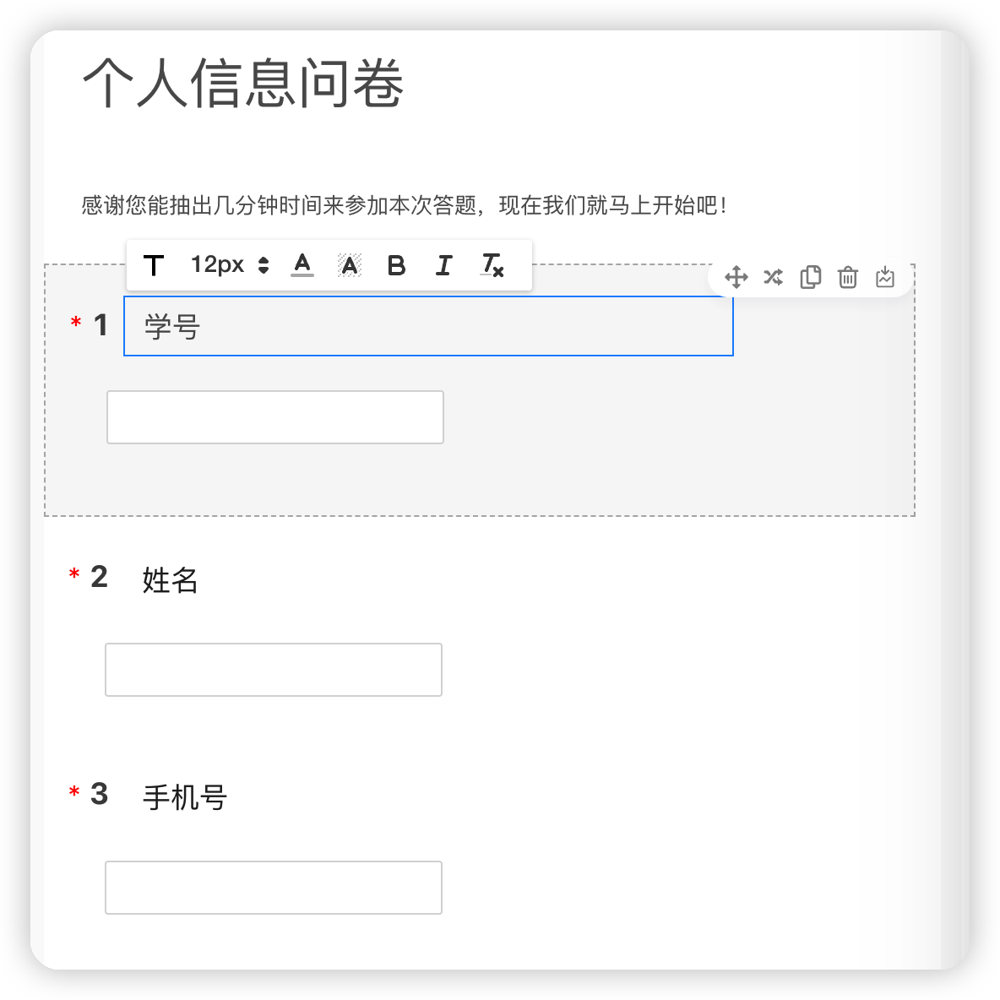
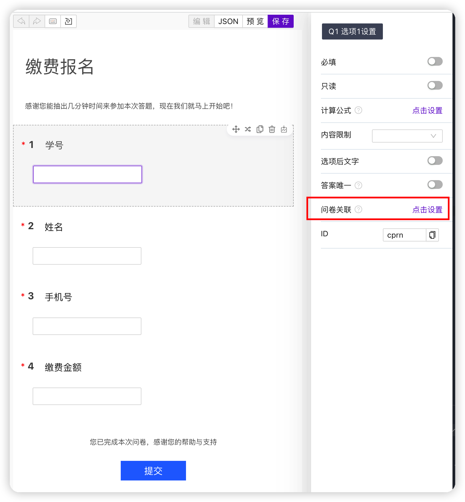
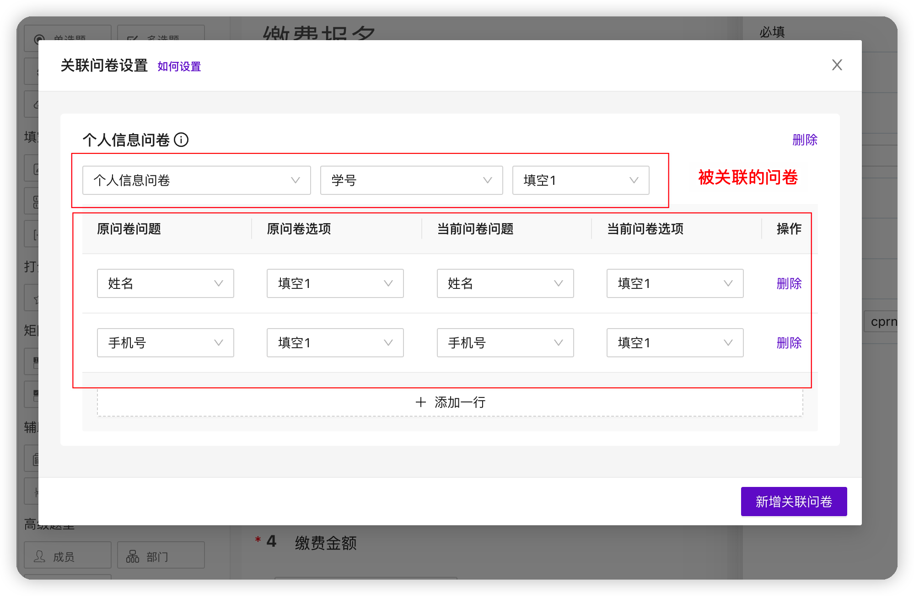

:::tip 什么是问卷关联？
卷王支持多个问卷数据关联（目前仅支持文本题的数据关联，后续将陆续开放其他题型）。

允许将**一个或者多个**问卷的值通过关联条件带入到另外一个问卷
:::

### 如何使用

首先创建**个人信息问卷**

然后创建 **缴费报名** 问卷，两个问卷通过学号进行关联，缴费报名问卷自动带入姓名和手机号。

点击选项设置，点击**问卷关联**。

打开问卷关联页面

上面设置解释如下：

1. 将缴费报名问卷的学号题与个人信息问卷的学号题进行关联
2. 将个人信息问卷的姓名和手机号带入到缴费报名问卷
3. 当我们打开缴费报名问卷，输入正确的学号之后，会查询个人信息问卷关联的信息，并将答案带入到缴费报名问卷
4. 如果不允许被关联的问题被修改，可以在问题设置里面设置为 问题只读

## 演示

