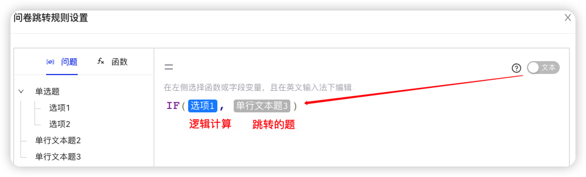
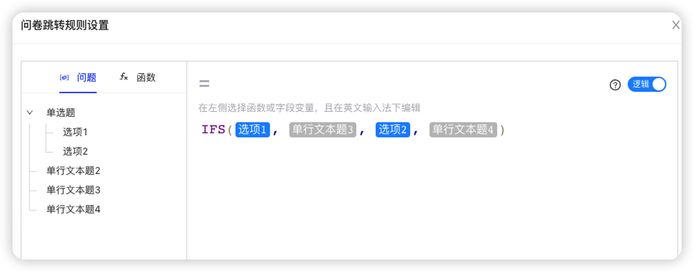
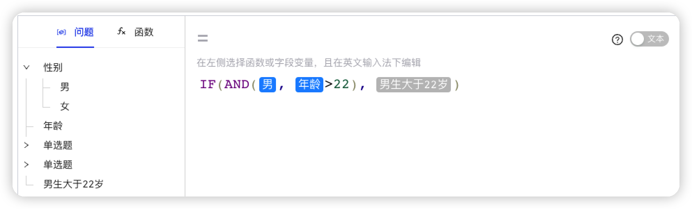

:::important 什么是跳转逻辑？
满足跳转条件之后，会直接从配置公式的题跳转到指定的题。

打开问题设置栏，点击**跳转公式**。
:::

## 单选项跳转

单选题选择了选项1，则跳转到单行文本题3。

**注意要跳转的题需要设置为文本，否则会被当做逻辑参与公式计算**。

## 单多选项动态跳转

选择了选项1，跳转到但行文本题3；选择了选项2，跳转到单行文本题4。

## 多题多选项动态跳转

如果选择了男生，并且年龄大于22岁，则直接跳转到男生大于22岁这个题。

