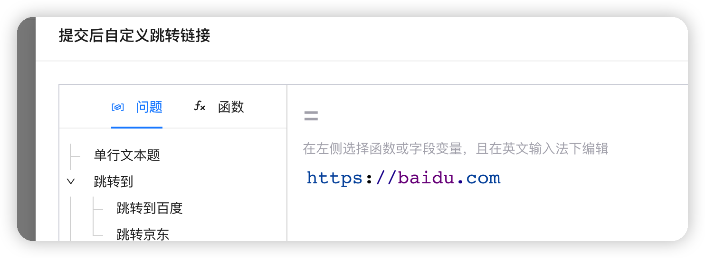
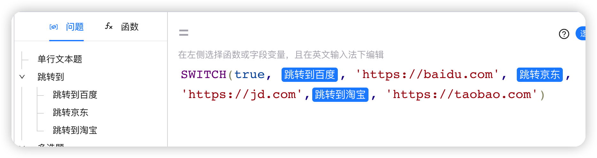
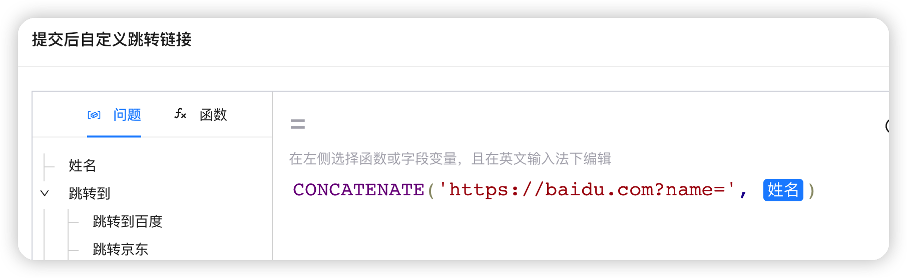
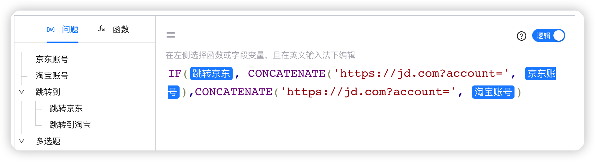

:::important 什么是自定义跳转逻辑？
问卷打完之后，可以跳转到指定的链接，并且支持根据问卷里面的答案动态跳转到不同的链接。

:::

通过 **设置** -> **投放与分享** -> **答题完成后跳转自定义链接** 设置

## 普通跳转逻辑

答完问卷直接，直接跳转到指定链接。

## 根据题目答案动态跳转

根据问卷答案动态跳转到不同的链接。

## 跳转链接携带问卷答案参数

如问卷里面姓名题的答案填写 ”大黄"，则答完问卷之后会跳转到  [https://baidu.com?name=大黄](https://baidu.com?name=%E5%A4%A7%E9%BB%84) 。

注意：得使用 `CONCATENATE` 函数，否则会出现错误。 

### 复杂跳转逻辑和答案组合

如果选择了跳转京东，则会跳转到 [https://jd.com?account=xxxx](https://jd.com?account=xxxx)；如果选择了跳转到淘宝，则会跳转到 [https://taboa.com?account=yyyy](https://taboa.com?account=yyyy)

