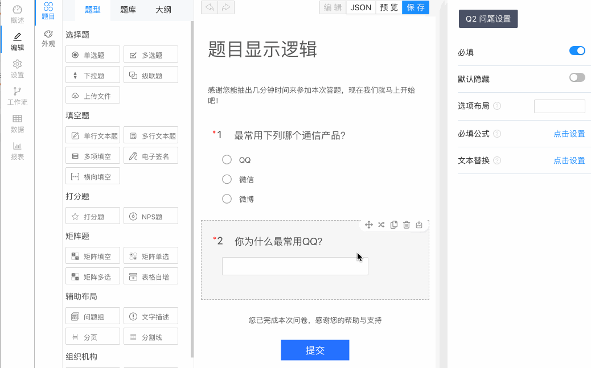

:::important 什么是显示逻辑？

当前问题的显示隐藏由别的问题或者选项的答案来动态控制。

:::

## 普通显示逻辑

选中某个选项，显示下一道题。

### 例子

:::note 问卷
Q1. 最常用下列哪个通信产品？【单选】Q1

- A. QQ
- B. 微信
- C. 微博

Q2. 你为什么最常用QQ？【文本题】Q2
:::

### 自定义逻辑

如何操作

> 只需要打开逻辑设置编辑器，在问题里面选择对应的选项点击确定即可。

### 在线效果预览

  <iframe src="https://wj.surveyking.cn/s/UvQJjX?preview=1" style={{border: "1px solid #eee", marginBottom: "1em"}} width="100%" height="350" />

