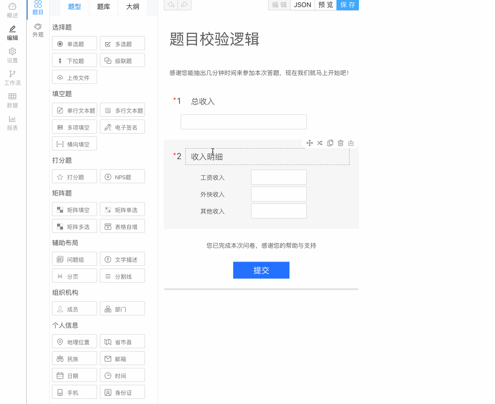

:::important 什么是校验逻辑？
当前问题校验的错误消息可以由别的问题或者选项的答案来动态控制。

打开问题设置栏，点击**校验逻辑**。
:::

## 普通校验逻辑

比较两个问题的答案，然后设置校验信息。

### 例子

总收入必须等于收入明细，否则问卷不能提交，并在问题上提示错误消息。

:::note 问卷
Q1. 总收入？【填空】Q1

Q2. 收入明细【多项填空】Q2

- 工资收入
- 外快收入
- 其他收入
:::

### 自定义公式

:::tip 公式
IF(**总收入**!=(**工资收入**+**外快收入**+**其他收入**), '总收入需要等于收入明细', '')

公式解析：如果总收入不等于工资收入+外快收入+其他收入，则会提示总收入需要等于收入明细，否则就不会提示('' 表示空值，表示校验成功)
:::

如何操作

### 在线效果预览

  <iframe src="https://wj.surveyking.cn/s/XGjkMf?preview=1" style={{border: "1px solid #eee", marginBottom: "1em"}} width="100%" height="400" />

